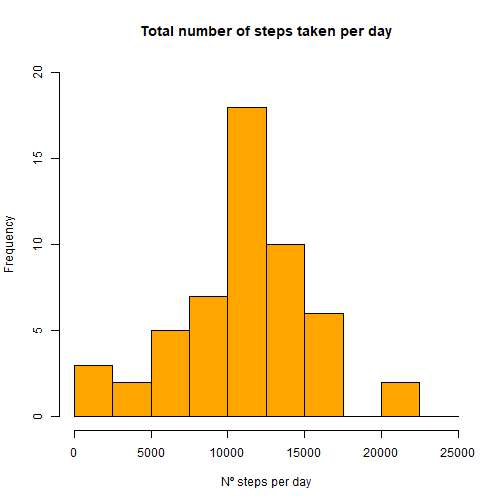
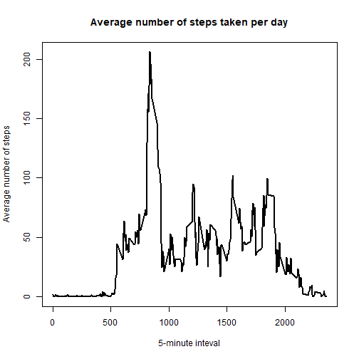
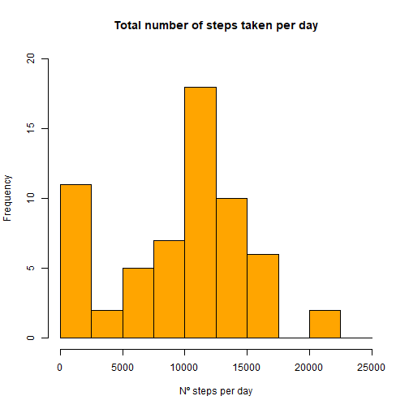
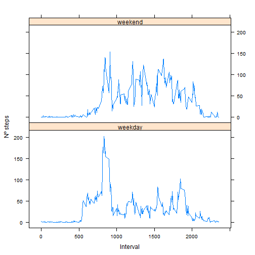

Hello everyone, this R Markdown document is supposed to address the questions of the first assignment from JHU's course "Reproducible Research", delivered through Coursera platform. The steps to carry out this project are:

## Load and process data (aggregate steps per day and remove NAs:


```r
URLzip <- "https://d396qusza40orc.cloudfront.net/repdata%2Fdata%2Factivity.zip"
download.file(URLzip, "./RepData.zip", method = "curl")
unzip("./RepData.zip", exdir = "./RepData")
steps <- read.csv("./RepData/activity.csv", header = TRUE, sep = ",")
```

Once we have assigned the dataset to our variable "steps", we can start answering the questions of the project:

## What is the mean total number of steps taken per day?

For this question, we can ignore missing values. After that, we have to calculate and plot via histogram the total number of steps taken per day, and then include the mean and median number of steps per day.


```r
steps_day <- aggregate(steps ~ date, data = steps, FUN = sum, na.rm = TRUE)
with(steps_day, hist(steps, xlab = "Nº steps per day", main = "Total number of steps taken per day", col = "orange", ylim = c(0,20), breaks = seq(0,25000, by = 2500)))
```



```r
mean(steps_day$steps)
```

```
## [1] 10766.19
```

```r
median(steps_day$steps)
```

```
## [1] 10765
```


## What is the average daily activity pattern?

In this case, we'll aggregate the mean of steps taken per 5-minute interval and plot it, in order to discover in which interval has more steps been taken:


```r
steps_interval <- aggregate(steps ~ interval, data = steps, FUN = mean, na.rm = TRUE)
with(steps_interval, plot(interval, steps, xlab = "5-minute inteval", ylab = "Average number of steps", main = "Average number of steps taken per day", type = "l", lwd = 2))
```



```r
steps_interval[which.max(steps_interval$steps),]$interval
```

```
## [1] 835
```

## Imputing missing values

Missing values (marked as NAs) can cause significant variations while doing statistical analysis. Regarding this dataset, the number of NAs is:


```r
sum(is.na(steps))
```

```
## [1] 2304
```

To correct bias provoked by this missing values, we'll impute them by using the median/mean of that day. There is an R package available in CRAN called "imputeMissings" that you can install if you don't have it. Once installed, the imputation would be:


```r
library(imputeMissings)
imputed_steps <- impute(steps, object = NULL, method = "median/mode" , flag = FALSE)
```

Now, we can do as earlier in this markdown document, to calculate and plot with a histogram the total number of steps taken per day, and then include the mean and median number of steps per day.


```r
imputed_steps_day <- aggregate(steps ~ date, data = imputed_steps, FUN = sum, na.rm = TRUE)
with(imputed_steps_day, hist(steps, xlab = "Nº steps per day", main = "Total number of steps taken per day", col = "orange", ylim = c(0,20), breaks = seq(0,25000, by = 2500)))
```



```r
mean(imputed_steps_day$steps)
```

```
## [1] 9354.23
```

```r
median(imputed_steps_day$steps)
```

```
## [1] 10395
```

## Are there differences in activity patterns between weekdays and weekends?

Finally, we are going to check if there are differences in patterns depending if it's a weekday or weekend. For this part, we'll use now the dataset version with imputed NAs:


```r
imputed_steps$date <- as.Date(imputed_steps$date, "%Y-%m-%d")
weekday <- weekdays(imputed_steps$date)
weekday_steps <- cbind(imputed_steps, weekday)
weekday_steps$DayType <- ifelse(weekday_steps$weekday == "sábado" | weekday_steps$weekday == "domingo", "weekend", "weekday")
```
Note: my R is setup in Spanish. If yours is in English replace "sábado" by Saturday and "domingo" by Sunday.

After weekdays have been assigned to their respective day type, we'll aggregate the mean of steps taken per 5-minute interval and plot it:


```r
library(lattice)
weekday_steps_interval <- aggregate(steps ~ interval + DayType, data = weekday_steps, FUN = mean)
xyplot(steps ~ interval | DayType, data = weekday_steps_interval, type = "l", layout = c(1,2), xlab = "Interval", ylab = "Nº steps")
```


